# 操作系统课设

#### 实验一:为Linux系统增加系统调用

通过修改Linux 0.11系统文件, 实现增加一个简单的系统调用

###### 0.环境配置

在Ubuntu20.04.1虚拟机上, 用Bochs运行Linux0.11编译出的image文件
 编译Linux0.11需要32位gcc环境, 附一个简单可行的环境配置链接: https://gitee.com/cn-guoziyang/oslab

###### 1.程序功能

通过修改Linux 0.11系统文件(使用Bochs运行), 实现增加一个简单的系统调用
 此处是调用nameout.c输出”Hello, I’m lwh”

###### 2.设计思路

在用户层面编写程序nameout.c，通过syscall这个宏开启调用系统函数的窗口，调用sys_nameout系统函数。
 编写函数sys_nameout，以name.c的文件格式保存在了linux0.11系统kernel中；
 sys_nameout调用了printk（）完成打印输出。
 修改Makefile文件让我们添加的 kernel/who.c 可以和其它 Linux 代码编译链接到一起

详细步骤:
 添加iam和whoami系统调用编号的宏定义(_NR_xxxxxx)

文件路径：/linux-0.11/**include/unistd.h
** 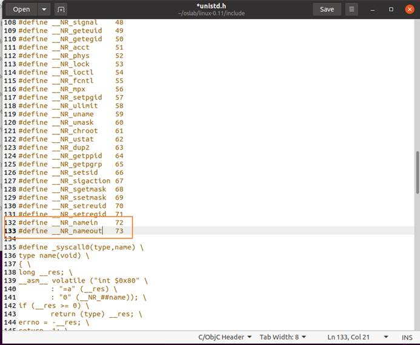 

 

修改系统调用总数
 文件路径：/linux-0.11/**kernel/system_call.s
** 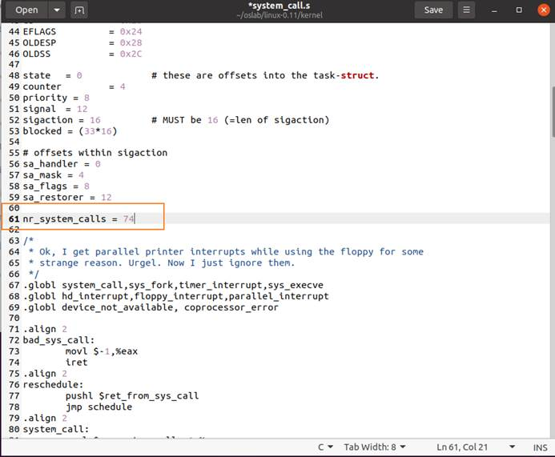

 

为新增的系统调用添加系统调用名并维护系统调用表
 文件路径：/linux-0.11/**include/linux/sys.h**

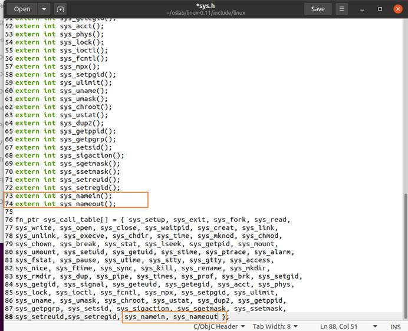

 

为新增的系统调用编写代码实现,创建一个文件 `name.c`
 **文件路径****: /linux-0.11/kernel**

name.c中写入printk(”Hello, I’m lwh”)

 

修改 Makefile

要想让我们添加的 kernel/who.c 可以和其它 Linux 代码编译链接到一起，必须要修改 Makefile 文件

文件路径: / linux-0.11/kernel/Makefile

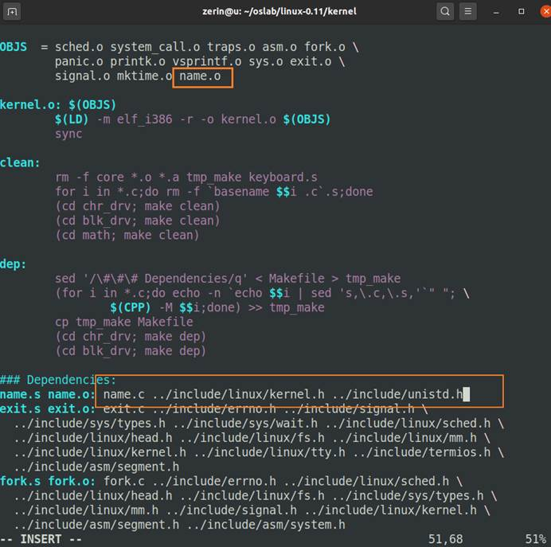

 

编写测试程序

到此为止，内核中需要修改的部分已经完成，接下来需要编写测试程序来验证新增的系统调用是否已经被编译到linux-0.11内核可供调用

文件路径:/oslab/namein.c /oslab/nameout.c

 

 

/* nameout.c */

\#define __LIBRARY__

\#include <unistd.h> 

\#include <errno.h>

\#include <asm/segment.h> 

\#include <linux/kernel.h>

\#include <stdio.h>

  

_syscall2(int, nameout,char *,name,unsigned int,size);

  

int main(int argc, char *argv[])

{

  char username[64] = {0};

  /*调用系统调用nameout()*/

  nameout(username, 24);

  printf("%s\n", username);

  return 0;

}

 

采用挂载方式实现宿主机与虚拟机操作系统的文件共享，在 `oslab` 目录下执行以下命令挂载hdc目录到虚拟机操作系统上

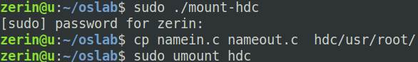

 

编译linux内核
 文件路径: /oslab/linux

终端执行 make命令
 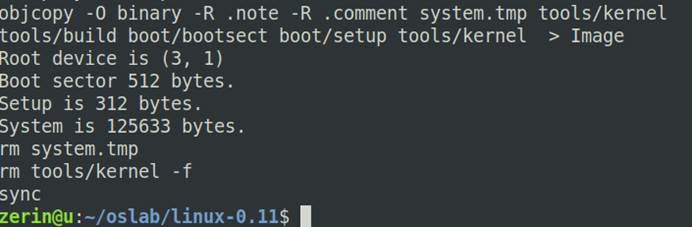

Make成功

 

运行Bochs虚拟机
 文件路径: /oslab/
 终端执行 run命令
 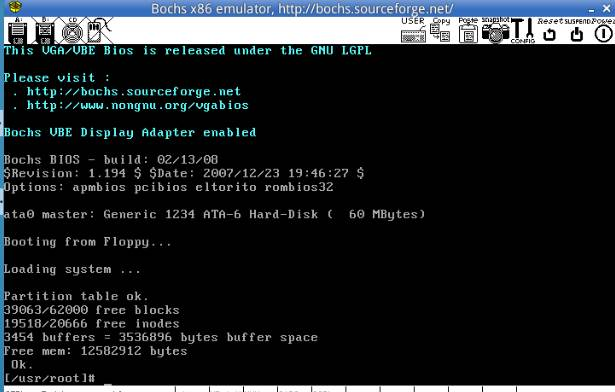
 

为linux-0.11新增调用号
 文件路径: 虚拟机中/usr/include/unistd.h(也可以挂载后在图形界面中修改)
 

(若在虚拟机中修改)
 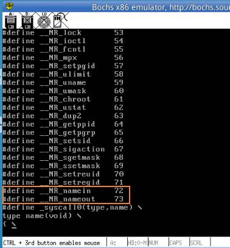
 (若挂载后在主机的图形界面中修改)

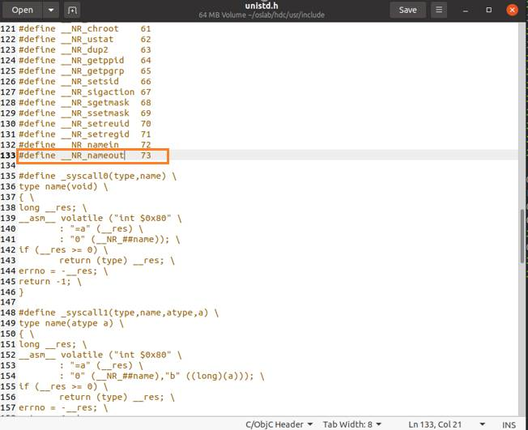

gcc运行 成功输出案例文字

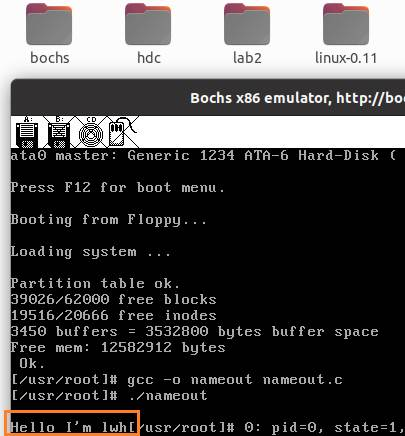

###### 3.程序运行情况及截图

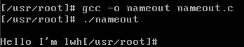

 

#### 实验二:磁盘调度算法

使用FIFO(先来先服务)、SSTF(最短寻道优先)以及SCAN(电梯调度算法)进行磁盘调度  

显示调度顺序, 计算出平均移动磁道数  

#### 实验三: Linux系统文件调用接口

使用文件系统调用编写一个文件工具 filetools，使其具有以下功能：  

创建新文件, 写文件, 读文件, 修改文件权限, 查看当前文件权限, 退出  

#### 实验四: 进程管理

使用管道来实现父子进程之间的进程通信  

#### 实验五: 请求分页系统中的置换算法

产生320条指令序列  

将指令序列变换成页地址流  

分别计算先进先出（FIFO）页面置换算法，最近最久未使用（LRU）页面置换算法，最佳（Optimal）页面置换算法在不同内存页块下的命中率  

#### 实验六: 进程通信

使用管道来实现父子进程之间的进程通信  

使用消息缓冲队列来实现 client 进程和 server 进程之间的通信  

使用共享存储区来实现两个进程之间的进程通信  