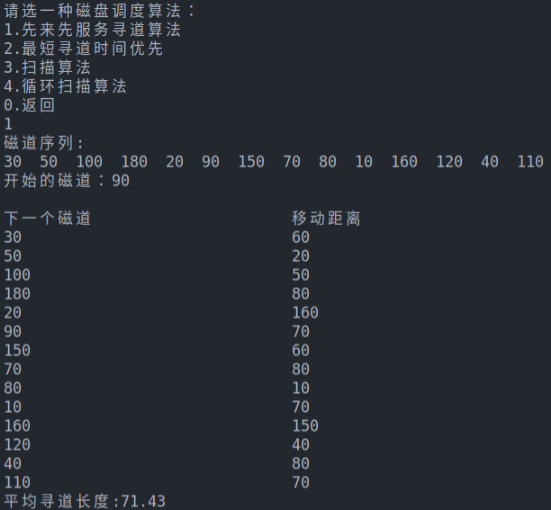
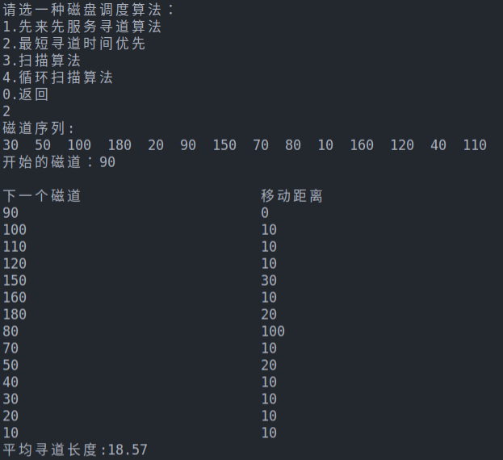
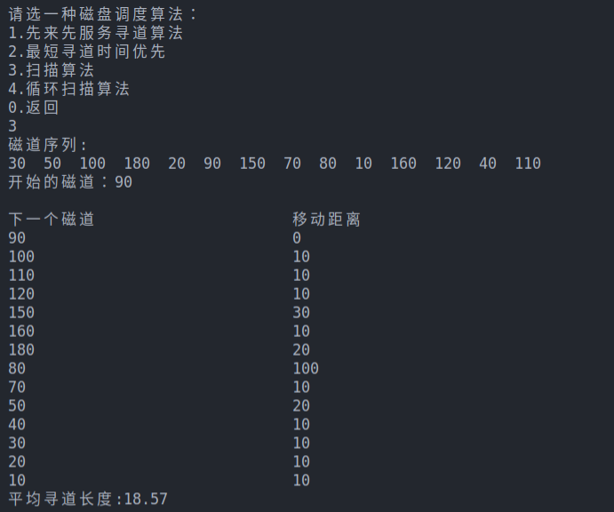
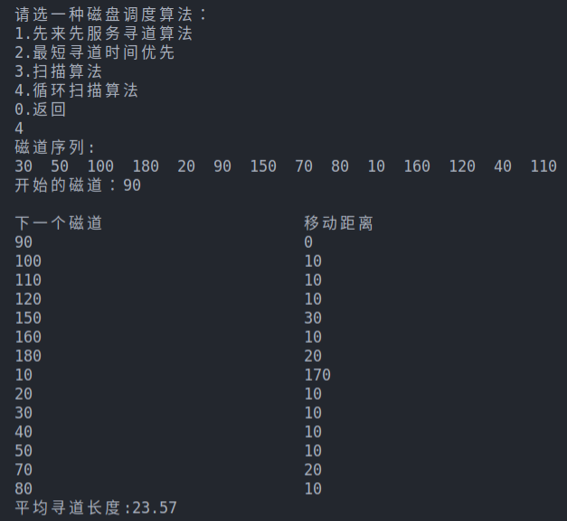

# disk_scheduling
使用FIFO(先来先服务)、SSTF(最短寻道优先)以及SCAN(电梯调度算法)进行磁盘调度

#### 一、要求

1、对于如下给定的一组磁盘访问进行调度:  
请求服务到达	A	B	C	D	E	F	G	H	I	J	K	L	M	N  
访问的磁道号	30	50	100	180	20	90	150	70	80	10	160	120	40	110  
2、要求分别采用先来先服务、最短寻道优先以及电梯调度算法进行调度  
3、要求给出每种算法中磁盘访问的顺序，计算出平均移动道数  
4、假定当前读写头在90号，电梯调度算法向磁道号增加的方向移动  

#### 二、函数说明

###### (1)average函数

将每次寻道的距离数组length[]传入函数, 将其累加求平均值

###### (2)first_come_first_server函数

先来先服务算法  
定义visit[]数组, 来记录请求是否被处理, 若处理过, 则查看下一个请求  
求出每次寻道的距离, 将其放入length[]中

###### (3)shortest_seek_time_first函数

最短寻道时间优先算法  
定义flag记录当前最短路径下标  
用for循环找没有访问过的中最近的  
每找到一个将其放入length[]中, 并设为已访问

###### (6)scan函数

扫描算法  
调用sort函数将所有请求按从小到大排序  
通过for循环找到离当前磁头最近的请求磁道, 随后往递增方向访问, 全部访问完成, 再往递减方向访问  
每次访问完更新磁头位置

#### 三、运行结果

