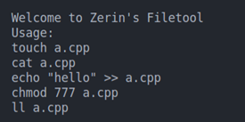
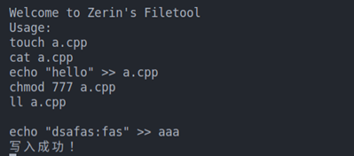
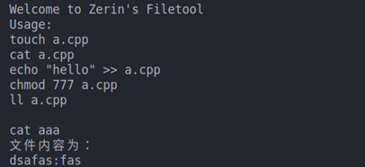
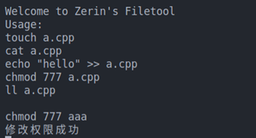
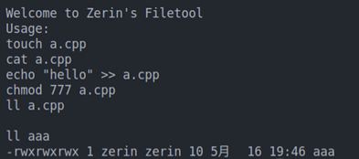

# file-system-call
通过编写文件工具filetool调用文件系统

#### 一、要求

使用文件系统调用编写一个文件工具 filetools，使其具有以下功能：   
1.创建新文件  
2.写文件  
3.读文件  
4.修改文件权限  
5.查看当前文件权限  
0.退出  

#### 二、程序功能

实现文件调用系统，实现linux文件系统调用  
支持输入文件名，实现打开或创建文件（如果该文件不存在）  
支持文件写入，在打开文件或者新建文件之后，用户可以如何任何内容加入到当前文件的后面  
支持读文件功能，展现文件信息  
支持修改权限文件功能 例如777表示所有者，所属者和其他人都存在读写执行的权限  
支持查看文件类型，格式为-rwxrwxrwx-  
支持退出当前文件，重新打开或者创建新的文件  

#### 三、设计思路

###### 1.创建新文件函数  

umask(0000); //建立新文件时的权限遮罩   
通过open(filename, O_RDWR | O_CREAT, 0666)函数创建文件  
得到的文件权限为0666-0000   
fd<0时, 提示创建失败

###### 2.写文件函数  

通过open(filename, O_WRONLY);打开指定文件, 权限是只写  
write(fd, buffer, strlen(buffer));将缓存区的内容写入

###### 3.读文件函数  

open(filename, O_RDONLY); 打开指定文件, 权限是只读  
lseek(fd, 0, SEEK_SET); lseek函数定位一个已经打开的文件, 第2 3参数将读写位置移到文件开头  
创建缓存区  
read(fd, buffer, 1 << 15);读取内容到缓存区  
打印缓冲区内容

###### 4.修改文件权限函数  

打开指定文件  
十进制转八进制  
int mode_u = mode / 100;						 // user  
int mode_g = mode / 10 % 10;					 // group  
int mode_o = mode % 10;							 // others  
mode = (mode_u * 8 * 8) + (mode_g * 8) + mode_o;   
chmod(filename, mode);修改权限  

###### 5.查看文件权限  

打开指定文件  
char *pargv[4] = {"ls", "-l", NULL, NULL};  
需要将文件名传到*pargv[2]  
pargv[2] = (char *)malloc(50);  
strcpy(pargv[2], filename);  
查看指定文件的权限  
execv("/bin/ls", pargv);

###### 6.输入处理函数

通过sstream流, 处理输入的字符
取touch cat echo chmod ll 的前两个字母通过s.find来查找字符中是否存在对应的关键字, 若存在, 就调用对应函数

#### 四、运行结果

交互界面

新建文件

写入文件

查看文件

改变文件权限

查看文件权限

#### 五、相关信息:

系统需要根据用户提供的参数来查找文件的目录项，并由目录项找到文件的磁盘 i 结点，再将它调到内存 i 结点，才能建立用户进程与该文件之间的联系。
同样，在文件操作完毕后要关闭文件，以切断用户进程与文件的联系，释放相关资源。
Open 系统调用
int open(const char *path, int flags);
int open(const char *path, int flags,mode_t mode);
一般情况下使用两个参数的格式，只有当打开的文件不存在时才使用 3 个参数的格式。参数：
Path 指向所要打开的文件的路径名指针。
int close(int fd)
Fd 为打开文件时系统返回的文件标识符
系统执行该系统调用时，根据 fd 值在该进程的进程打开文件表中找到 fd 标识，根据指针找到系统打开文件表，再找到内存 i 结点表中相应的 i 结点，对其 i_count 进行减 1 操作，
然后释放系统打开文件表中的表项和进程打开文件表的表项 返回结果：调用成功返回 0

打开文件，首先输入文件名新建文件

写文件，首先判断文件是否打开，否则必须调用功能打开文件，然后使用过write(fd, buffer, strlen(buffer))系统函数写入文件。

修改文件权限，首先判断文件是否打开，否则必须调用功能打开文件。输入格式为777（或者其他权限），首先对模式分解，调用系统函数chmod。修改是否成功给出提示信息。

读文件，首先判断文件是否打开，否则必须调用功能打开文件。清空缓冲区，打印到界面。

查看文件权限，首先判断文件是否打开，否则必须调用功能打开文件。调用execv系统功能函数。

