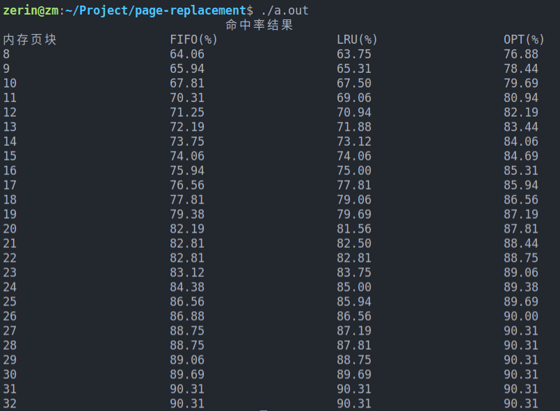

# page-replacement
分页系统中的先进先出页面置换(FIFO), 最近最久未使用(LRU), 最佳页面置换(Optimal)算法

#### 一、要求

###### 1.通过如下方法产生一指令序列，共 320 条指令

A.在[1，32k - 2]的指令地址之间随机选取一起点, 访问 M；  
B.顺序访问M + 1；  
C.在[0，M - 1]中随机选取M1，访问 M1；  
D.顺序访问M1 + 1；  
E.在[M1 + 2，32k - 2]中随机选取M2，访问 M2；  
F.顺序访问M2 + 1；  
G.重复 A—F，直到执行 320 次指令。  

###### 2.指令序列变换成页地址流

（1）页面大小为 1K；  
（2）分配给用户的内存页块个数为 8页到 32 页, 步长为1页；  
（3）用户虚存容量为 32K。  

###### 3.计算并输出下述各种算法在不同内存页块下的命中率
A.先进先出（FIFO）页面置换算法  
B.最近最久未使用（LRU）页面置换算法  
C.最佳（Optimal）页面置换算法  

#### 二、程序功能

要求在随机生成的指令序列，页面大小为 1K，分配给用户的内存页块个数为 8 页到 32 页, 步长为1页。用户虚存容量为 32K。分别计算先进先出（FIFO）页面置换算法，最近最久未使用（LRU）页面置换算法，最佳（Optimal）页面置换算法在不同内存页块下的命中率。  

#### 三、设计思路

实现三种算法  
设计一个取指令函数，得到320个随机的指令序列  
主函数中设计一个循环, 依次输出计算出的值

###### 1.FIFO算法

用链表模拟队列。初始化之后，每次取得下一个指令，检查队列中存在对应的页号，如果存在命中次数加1，否则**删除队列中第一个页号**，插入当前页号。

###### 2.LRU算法

选择最近且最久未被使用的页面进行淘汰。利用局部性原理，根据一个作业在执行过程中过去的页面访问历史来推测未来的行为。它认为过去一段时间里不曾被访问过的页面，在最近的将来可能也不会再被访问。所以，这种算法的实质是：当需要淘汰一个页面时，总是选择在最近一段时间内最久不用的页面予以淘汰。 设置一个结构体，保存指令所在的页号和在队列中没有被访问的次数。如果需要淘汰，每次**淘汰没有被访问次数最多的页号**。  

###### 3.OPT算法

从主存中移出永远不再需要的页面；如无这样的页面存在，则选择最长时间不需要访问的页面。于所选择的被淘汰页面将是以后永不使用的，或者是在最长时间内不再被访问的页面，这样可以保证获得最低的缺页率。每次淘汰时，评估每一个页号将来的位置，**淘汰最长时间不需要访问的页面**。  

###### 4.取指令函数

取用srand(time(0)); 设定时间种子。使用随机函数rand() % M得到0~M - 1的随机数（M < MAX_INT），当指令到达320时，停止生成指令。**由于产生的为地址，最后需要除以1024得到所在的页号。 **  

#### 四、运行结果

