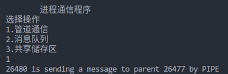
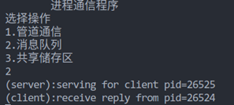
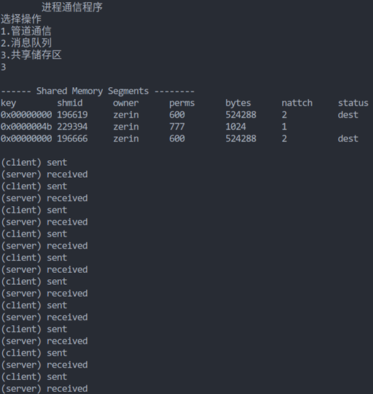

# process-communication

#### 一、程序功能

1.使用管道来实现父子进程之间的进程通信  
2.使用消息缓冲队列来实现 client 进程和 server 进程之间的通信  
3.使用共享存储区来实现两个进程之间的进程通信  

#### 二、设计思路

#### 1.通过管道通信

定义两个缓存区msg和buffer  
子进程1中输出字符串到msg中，调用write函数将其写入到fd[1]中  
父进程调用read函数将fd[0]中的数据读入到buffer中, 然后将其输出  

#### 2.通过消息缓冲队列通信

###### server端

server 进程先建立一个关键字为 SVKEY（如 75）的消息队列，然后等待接收类型为 REQ（例如 1）的消息；  
在收到请求消息后，它便显示字符串“serving for client”和接收到的 client 进程的进程标识数，表示正在为 client 进程服务；  
然后再向 client 进程发送应答消息，该消息的类型是 client 进程的进程标识数，而正文则是 server 进程自己的标识ID。  

###### client端

client 进程则向消息队列发送类型为 REQ 的消息（消息的正文为自己的进程标识 ID） 以取得 sever 进程的服务，并等待 server 进程发来的应答；   
然后显示字符串“receive reply from”和接收到的 server 进程的标识 ID  

#### 3.通过共享缓存区通信

###### server端

server创建共享存储区, 然后获取其首地址, 使用while (*addr == -1)阻塞自身, 用于进程同步

###### client端

client打开共享存储区, 然后获取其首地址, 使用while (*addr != -1)阻塞自身

#### 三、运行结果

