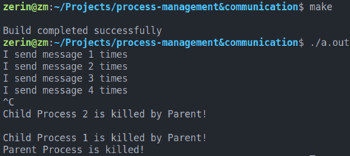

# process-managment

#### 一、程序功能

父进程使用pipe()建立一个管道，然后调用fork()创建子进程1和子进程2  
子进程1每隔1秒通过管道向子进程2发送数据“I send message x times”  
子进程2从管道读出信息，并显示在屏幕上  
父进程用系统调用signal()来捕捉中断信号，用kill()向两个子进程发出信号，子进程输出如下信息后终止： Child Process 1 is killed by Parent! Child Process 2 is killed by Parent!  
父进程等待两个子进程终止后，释放管道并输出Parent Process is Killed!  

#### 二、设计思路

定义两个进程  
定义两个缓存区msg和buffer  
子进程1中输出字符串到msg中，调用write函数将其写入到fd[1]中  
子进程2调用read函数将fd[0]中的数据读入到buffer中, 然后将其输出  
两进程中都使用signal(SIGINT, SIG_IGN);屏蔽系统定义的结束, 通过signal(SIGUSR1, userDefinedSignal);来调用自定义的信号对应的结束的函数

#### 三、运行结果

